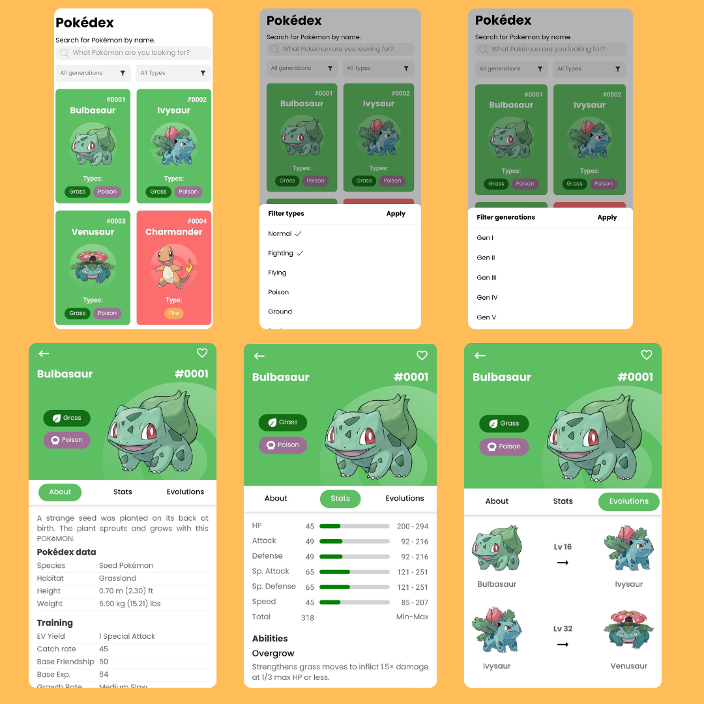

## Features

- Display a list of Pokémon with their names and images.
- Search for Pokémon by name.
- View detailed information about each Pokémon, including types, abilities, and stats.

# Preview



## Installation

To run this app, make sure you have Expo CLI installed. Follow these steps:

1. Clone this repository:

    ```bash
    git clone https://github.com/kufle/Pokedex.git
    ```

2. Navigate to the project directory:

    ```bash
    cd pokedex-app
    ```

3. Install dependencies:

    ```bash
    npm install
    ```

4. Run the app with Expo:

    ```bash
    npx expo start
    ```

    Follow the instructions to open the app on your Android/iOS device or emulator.

## Technologies Used

- React Native Expo
- GraphQL (for fetching data from PokeAPI)

## Credits

This app fetches Pokémon data from [PokeAPI](https://pokeapi.co/), which provides comprehensive information about Pokémon, types, stats, and more.
Icons for Pokémon types are provided by [Flavio Farias](https://www.behance.net/flaviofpsj) on Behance.

## License

Feel free to fork this project and improve it. Give a ⭐️ if you like this project!

Made with ❤️ by Irawan 👋🏻 [Get in touch!](https://irawandev.my.id)